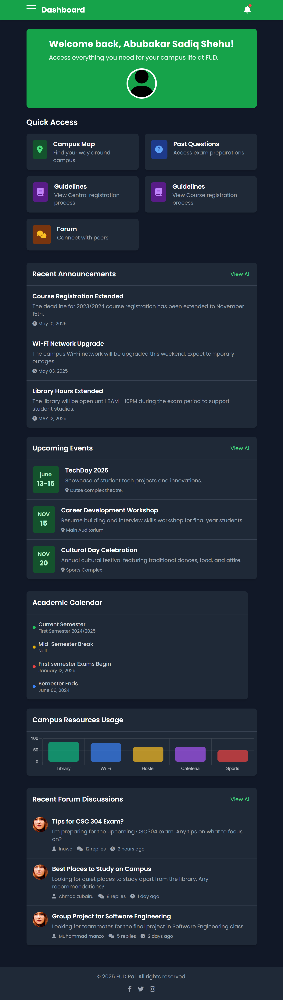

# FUD PAL

A student-centric platform for Federal University Dutse that provides campus navigation, registration guidance, student guidelines, academic resources, notifications, community forums, FAQs, and more. Built with PHP and Tailwind CSS for a modern, responsive experience.

## Features

- **Dashboard:** Personalized landing page with quick access to core areas.
- **Campus Map:** Interactive map for easy navigation on campus.
- **Registration Guide:** Step-by-step registration and payment guide for new/returning students.
- **Student Guidelines:** Information and resources for campus life.
- **Past Questions:** Access to previous exam questions.
- **Notifications:** Alerts and updates.
- **Community Forum:** Engage with other students and ask questions.
- **Profile Management:** Upload profile photo, manage details.
- **FAQs:** Frequently asked questions and contact support.

## Technology Stack

- **Backend:** PHP
- **Frontend:** Tailwind CSS, HTML, minimal JS, Owl Carousel
- **Icons:** Font Awesome

## Folder Structure

``` bash
fud-pal
├── 📁 api/
│   ├── 🐘 login_process.php
│   ├── 🐘 notification_api.php
│   └── 🐘 signup_process.php
├── 📁 assets/
│   ├── 📁 css/
│   │   └── 🎨 style.css
│   ├── 📁 images/
│   │   ├── 🖼️ Fud-Pal_dashboard.png
│   │   ├── 🖼️ FudPal.png
│   │   ├── 🖼️ Fud_20240913_191519_0000.png
│   │   ├── 🖼️ edited.jpg
│   │   ├── 🖼️ gencraft_image.png
│   │   ├── 🖼️ user-regular.svg
│   │   └── 🖼️ user-solid.svg
│   └── 📁 js/
│       ├── 📄 main.js
│       ├── 📄 map.js
│       ├── 📄 passwordGenerator.js
│       └── 📄 script.js
├── 📁 config/
│   └── 🐘 db_config.php
├── 📁 includes/
│   └── 🐘 config.php
├── 📁 node_modules/ 🚫 (auto-hidden)
├── 📁 pages/
│   ├── 📁 forums/
│   │   ├── 🐘 create.php
│   │   ├── 🐘 index.php
│   │   └── 🐘 topic.php
│   ├── 📁 profile/
│   │   ├── 🐘 change_password.php
│   │   ├── 🐘 edit.php
│   │   ├── 🐘 index.php
│   │   └── 🐘 notifications.php
│   ├── 🐘 faqs.php
│   ├── 🐘 guidelines.php
│   ├── 🐘 map.php
│   ├── 🐘 map2.php
│   ├── 🐘 notifications.php
│   ├── 🐘 past_questions.php
│   ├── 🐘 profile.php
│   ├── 🐘 profile_update.php
│   ├── 🐘 reg_guide.php
│   └── 🐘 upload_past_question.php
├── 📁 uploads/
│   ├── 📁 past_questions/
│   └── 📁 profile_pics/
├── 📁 utils/
│   ├── 🐘 auth.php
│   ├── 🐘 notification_functions.php
│   └── 🐘 upload_functions.php
├── 🚫 .gitignore
├── 📄 .htaccess
├── 📖 README
├── 📖 README.md
├── 🐘 dashboard.php
├── 🐘 index.php
├── 🐘 login.php
├── 🐘 login_process.php
├── 🐘 logout.php
├── 📄 package-lock.json
├── 📄 package.json
├── 🐘 reset_password.php
├── 🐘 signup.php
└── 🐘 signup_process.php
```

## Setup & Installation

1. Clone this repository into your local development environment.
2. Install XAMPP or WAMP if not already installed.
3. Place the `Fud-Pal` directory inside your `htdocs` (XAMPP) or `www` (WAMP) folder.
4. Start Apache and MySQL via XAMPP/WAMP control panel.
5. Access the project at: `http://localhost/Fud-Pal/index.php`.
6. Update database connection parameters in `includes/config.php` if needed.

## Usage

- Log in/register as a student to access all modules.
- Navigate using the sidebar or quick actions.
- Use the Registration Guide for help with school processes.
- Visit Forums and FAQs for community support.

## Screenshots



## Contributing

Contributions are welcome! If you find bugs, want to add features, or improve documentation:

1. Fork the repository.
2. Create your feature branch: `git checkout -b feature/your-feature`
3. Commit your changes: `git commit -m "Your detailed message"`
4. Push to the branch: `git push origin feature/your-feature`
5. Open a Pull Request.

## License

MIT LICENSE
